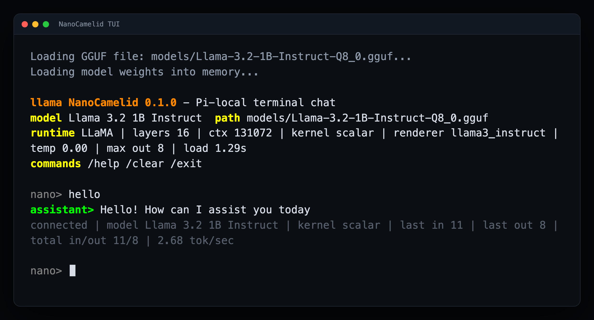

# NanoCamelid

NanoCamelid is a compact Rust inference runtime for running GGUF local chat
models on Raspberry Pi-class ARM64 hardware.

It is not a wrapper around a desktop inference stack. The current goal is a
small, inspectable runtime that can load local GGUF files, run model smoke tests,
chat in a terminal, and make every performance claim traceable to Pi-side
evidence.

## Current State

- GGUF metadata and tensor layout inspection are available.
- Q8_0, Q4_0, Q4_1, Q5_0, Q5_1, Q2_K, Q3_K, Q4_K, Q5_K, and Q6_K tensor
  paths are implemented in the runtime. The model catalog below only marks rows
  as supported after Pi-local, row-specific smoke/parity evidence exists.
- Llama, Qwen, ChatML, Mistral, DeepSeek-R1-Qwen, and Gemma turn-template
  rendering is available for smoke tests and chat.
- The terminal TUI keeps the model loaded and reuses matching KV-cache prefixes
  across turns.
- Prompt ingestion uses guarded batched prefill by default. The current default
  batch size is `16`.
- Long-context models can be smoke-tested with an explicit
  `NANOCAMELID_CONTEXT_LIMIT` cap to avoid allocating their full advertised KV
  cache.
- On AArch64 boards with dot-product support, NanoCamelid now auto-selects the
  SDOT Q8 kernel, Q4_0 1x4 swizzled layout, Q4_0/Q6_K SDOT matmuls, and
  head-parallel attention by default. Scalar and forced-kernel modes remain
  available for comparison.
- Scalar reference paths remain in the test suite. Optimized kernels are kept
  tied to parity tests and Pi-side smoke evidence.
- The working model catalog lives in
  [`docs/MODEL_CATALOG.md`](docs/MODEL_CATALOG.md). It separates Pi-smoked
  supported rows from likely-compatible candidates and broader runtime families
  that still need more evidence before broad claims.

Quick 1B readiness check on a Pi workspace:

```bash
CARGO_TARGET_DIR=/mnt/nanocamelid/target cargo run -- model 1b --dry-run
CARGO_TARGET_DIR=/mnt/nanocamelid/target cargo run -- inspect 1b --dry-run
./scripts/pi/model-1b.sh --dry-run
./scripts/pi/ready-1b.sh
./scripts/pi/chat-1b.sh --dry-run
./scripts/pi/context-pack-1b.sh --dry-run
CARGO_TARGET_DIR=/mnt/nanocamelid/target cargo run -- inspect 1b
CARGO_TARGET_DIR=/mnt/nanocamelid/target cargo run -- smoke 1b chat "Say hello in one sentence." 8
CARGO_TARGET_DIR=/mnt/nanocamelid/target NANOCAMELID_READY_TOKENS=8 cargo run -- ready 1b
```

`inspect 1b` resolves `NANOCAMELID_SMOKE_GGUF` or `NANOCAMELID_MODEL_GGUF`
first, then the Pi-local `Llama-3.2-1B-Instruct-Q4_0.gguf` or Q8_0 fallback
under `${NANOCAMELID_WORKSPACE:-/mnt/nanocamelid}/models`.
`model 1b --dry-run` prints the same selected source, Q4_0/Q8_0 default paths,
and existence checks from the Rust CLI before the heavier inspect or smoke
gates.
`inspect 1b --dry-run` prints the resolved inspect command and model existence
checks without opening the GGUF, so it is safe before the model has been copied.
`./scripts/pi/model-1b.sh --dry-run` prints the same 1B model resolution plan
and shows whether the Q4_0, Q8_0, and selected GGUF files exist before you run
the heavier smoke gate.
`smoke 1b` now runs the strict Llama 3.2 1B shape audit before the
scalar-vs-selected smoke validation; dry runs print `shape_audit: enabled` so
automation can confirm the guard is in the plan without opening the GGUF.
The `generate 1b`, `chat 1b`, and `tui 1b` commands use the same Pi-local 1B
model resolution, with `NANOCAMELID_MODEL_GGUF` available as an explicit
override.
`ready 1b` runs the host fast-path probe, strict Llama 3.2 1B shape audit,
inspect, scalar-vs-selected smoke validation, and one direct chat turn. Set
`NANOCAMELID_READY_CHAT=0` for probe+audit+inspect+smoke only, or set
`NANOCAMELID_READY_PROMPT`, `NANOCAMELID_READY_TOKENS`, and
`NANOCAMELID_READY_TEMP` when the direct chat turn should differ from the smoke
prompt.
`./scripts/pi/chat-1b.sh --dry-run` prints the exact smoke and TUI launch plan
without requiring the GGUF to exist yet.
`./scripts/pi/context-pack-1b.sh` reruns the 1B smoke gate across context caps
from `NANOCAMELID_CONTEXT_PACKS`, defaulting to `512,1024,2048,4096,8192`.
`./scripts/pi/bench-1b-prefill.sh --dry-run` prints the real 1B prefill batch
sweep plan and validates any `NANOCAMELID_CONTEXT_LIMIT` cap before the model is
loaded.
The `inspect 3b`, `generate 3b`, `chat 3b`, `tui 3b`, and `smoke 3b` aliases
resolve the Pi-local `Llama-3.2-3B-Instruct-Q4_0.gguf` row.

## High-Performance Architecture

NanoCamelid is tuned around the Raspberry Pi 5's Cortex-A76 cores rather than
being a general desktop inference wrapper. The current fast path is built from a
small set of explicit runtime choices:

- **Auto-detected SDOT kernels.** When `NANOCAMELID_Q8_DOT_KERNEL` is unset,
  the runtime probes CPU features and selects SDOT on AArch64 systems with
  dot-product support, NEON when SDOT is unavailable, and scalar otherwise.
- **Q4_0 1x4 swizzled storage.** Compatible Q4_0 matrices are swizzled at load
  time so four adjacent rows can be streamed together in cache-friendly chunks.
- **Q4_0 and Q6_K SDOT matmuls.** The ARM dot-product paths are enabled by
  default on supported CPUs, with scalar references retained for tests and
  diagnostics.
- **Vectorized activation quantization.** AArch64 builds use NEON rounding and
  saturating-narrowing instructions for Q8 activation blocks, avoiding the
  scalar per-element round/clamp loop in the hot path.
- **Head-parallel attention.** Attention heads can be evaluated across Rayon
  workers using per-head scratch storage. This is most useful on longer prompts;
  very short prompts are still dominated by matmul work.
- **Governor telemetry.** `probe` and the TUI surface CPU governor information
  and recommend the non-overclock `performance` governor when Linux reports
  `ondemand`.

The implementation uses stable Rust with targeted `unsafe` AArch64 intrinsics
inside hot kernels. The goal is not a huge abstraction stack; it is an
inspectable Pi runtime where each optimization has a fallback, a test, or a
smoke path.

## Recent Pi Results

Latest runtime evidence below was captured through `59e374d`
(`perf(neon): vectorize activation Q8 block quantization using rounding and
saturating narrowing instructions`).

On the Pi 2 benchmark lane, the default Q8 dot benchmark now auto-selects SDOT
with no speed environment variables set:

- selected kernel: `sdot`
- scalar median: about `3.18 ns/block`
- NEON median: about `2.11 ns/block`
- SDOT median: about `1.69 ns/block`
- SDOT speedup: about `1.88x` over the scalar run in that benchmark sample and
  about `1.25x` over NEON

The isolated Q4 layout benchmark for a Qwen-sized shape also shows the memory
layout win:

- row-major Q4: `90.536ms`
- swizzled 1x4 Q4: `70.648ms` (`1.28x`)
- page-aligned swizzled 1x4: `68.337ms` (`1.32x` vs row-major, `1.034x` vs
  contiguous swizzled)

Page alignment remains opt-in because the incremental real-model gain has not
justified the duplicate chunk storage.

Llama 3.2 1B Instruct Q4_0 now passes the Pi-local chat smoke path and direct
generation check with the default fast profile:

- `smoke q8-chat` generated text: `"Hello!"`
- `max_logit_delta: 0.00000000`
- direct generation prompt: `Say hello in one sentence.`
- model load: about `0.90s`
- prompt ingest: about `0.38s`
- generated text: `"Hello, how are you?" is`
- throughput: `8` tokens in `1.91s` (`4.18 tok/sec`)

Llama 3.2 3B Instruct Q4_0 is also supported as a Pi-local single-node row:

- `inspect 3b` reports `readiness: ready` and `tensor_layouts: ok`
- tokenizer: `llama3_instruct`
- `smoke 3b chat` generated text: `"Hello!"`
- `max_logit_delta: 0.00000000`
- direct generation prompt: `Say hello in one sentence.`
- model load: about `1.45s`
- prompt ingest: about `1.43s`
- generated text: `I'd like to introduce you to`
- direct generation throughput: `8` tokens in `3.60s` (`2.22 tok/sec`)
- chat smoke throughput: `2` tokens in `1.02s` (`1.96 tok/sec`)
- capped 8096-context smoke: `NANOCAMELID_CONTEXT_LIMIT=8096 ./scripts/pi/smoke-3b.sh chat ...`
  passed with `max_logit_delta: 0.00000000` and generated `"Hello!"`
- capped 8096-context TUI launch: `./scripts/pi/chat-3b.sh` loaded with `ctx 8096`

Small single-Pi support now has row-level evidence for load, direct completion,
chat completion, compact model parity, broader chat-template parity,
metadata-backed or template-shape chat rendering, unique perf/RSS sampling, and
capped context packs. The unique direct/chat runs below use a 512-token runtime
context cap; the context pack checks run `smoke ... chat` at each listed cap.

| Model row | Load + chat renderer | Direct completion | Chat perf/RSS | Compact parity | Broader chat parity | Checked context packs |
| --- | --- | --- | --- | --- | --- | --- |
| Qwen2.5 0.5B Instruct Q4_0 | `ready`; `qwen2`; `qwen_im` | 8 tokens at `28.41 tok/sec` | 4 tokens at `36.30 tok/sec`; HWM about `1.32 GiB` | `max_logit_delta: 0.00000000`, generated `" SMART"` | renderer `qwen_im`; `max_logit_delta: 0.00000000`, generated `"Hello"` | `512`, `1024`, `2048`, `4096`, `8192`: all exact parity |
| Qwen2.5-Coder 0.5B Instruct Q4_0 | `ready`; `qwen2`; `qwen_im` | 8 tokens at `32.16 tok/sec` | 4 tokens at `37.37 tok/sec`; HWM about `1.32 GiB` | `max_logit_delta: 0.00000000`, generated `"nodiscard"` | renderer `qwen_im`; `max_logit_delta: 0.00000000`, generated `"To"` | `512`, `1024`, `2048`, `4096`, `8192`: all exact parity |
| Qwen2.5-Coder 0.5B Instruct Q5_K_M | `ready`; `qwen2`; `qwen_im` | 8 tokens at `9.98 tok/sec` | 8 tokens at `9.71 tok/sec`; direct load about `0.55s` | Not yet covered by scalar-vs-selected smoke helper | renderer `qwen_im`; generated `"Certainly! Below is a simple Rust function"` | Not yet run |
| Qwen3 0.6B Instruct Q8_0 | `ready`; `qwen3`; `qwen_im` | 8 tokens at `5.90 tok/sec` | 8 tokens at `6.41 tok/sec`; sampled RSS about `1.41 GiB` | `max_logit_delta: 0.00000000`, generated `"0"` | renderer `qwen_im`; `max_logit_delta: 0.00000000`, generated `"0"` | `512`, `1024`, `2048`, `4096`, `8192`: all exact parity |
| Qwen3 1.7B Instruct Q8_0 | `ready`; `qwen3`; `qwen_im` | 8 tokens at `2.86 tok/sec` | 8 tokens at `2.87 tok/sec`; sampled RSS about `3.56 GiB` | `max_logit_delta: 0.00000000`, generated zero-width space | renderer `qwen_im`; `max_logit_delta: 0.00000000`, generated zero-width space | `512`, `1024`, `2048`, `4096`, `8192`: all exact parity |
| Qwen3 4B Instruct Q4_0 | `ready`; `qwen3`; `qwen_im` | 8 tokens at `2.22 tok/sec` | 8 tokens at `2.22 tok/sec`; sampled RSS about `5.50 GiB` | `max_logit_delta: 0.00000000`, generated `"ations"` | renderer `qwen_im`; `max_logit_delta: 0.00000000`, generated `"ations"` | `512`, `1024`, `2048`, `4096`, `8192`: all exact parity |
| SmolLM3 3B Q4_0 | `ready`; `smollm3`; `qwen_im_token_fallback` | 8 tokens at `3.10 tok/sec` | 8 tokens at `3.09 tok/sec`; sampled RSS about `3.94 GiB` | `max_logit_delta: 0.00000000`, generated `"<think>"` | renderer `qwen_im_token_fallback`; `max_logit_delta: 0.00000000`, generated `"<think>"` | `512`, `1024`, `2048`, `4096`, `8192`: all exact parity |
| SmolLM2 1.7B Instruct Q4_0 | `ready`; `llama`; `qwen_im` | Prompt ended immediately in direct mode | 2 tokens at `5.82 tok/sec`; sampled RSS about `2.02 GiB` | `max_logit_delta: 0.00000000`, generated `"Hello"` | renderer `qwen_im`; `max_logit_delta: 0.00000000`, generated `"Hello"` | `512`, `1024`, `2048`, `4096`, `8192`: all exact parity |
| Gemma 3 1B IT Q4_0 | `ready`; `gemma3`; `gemma_turn` | 8 tokens at `3.78 tok/sec` | 8 tokens at `3.83 tok/sec`; sampled RSS about `2.20 GiB` | `max_logit_delta: 0.00000000`, generated `"擬"` | renderer `gemma_turn`; `max_logit_delta: 0.00000000`, generated `"擬"` | `512`, `1024`, `2048`, `4096`, `8192`: all exact parity |
| DeepSeek-R1-Distill-Qwen 1.5B Q4_0 | `ready`; `qwen2`; `deepseek_r1_qwen` | 8 tokens at `12.38 tok/sec` | 4 tokens at `15.59 tok/sec`; HWM about `2.83 GiB` | `max_logit_delta: 0.00000000`, generated `"!"` | renderer `deepseek_r1_qwen`; `max_logit_delta: 0.00000000` | `512`, `1024`, `2048`, `4096`, `8192`: all exact parity |
| Llama 3.2 1B Instruct Q4_0 | `ready`; `llama`; `llama3_instruct` | 8 tokens at `4.11 tok/sec` | 2 tokens at `3.61 tok/sec`; HWM about `2.37 GiB` | `max_logit_delta: 0.00000000`, generated `","` | renderer `llama3_instruct`; `max_logit_delta: 0.00000000`, generated `"Hello"` | `512`, `1024`, `2048`, `4096`, `8192`: all exact parity |
| Llama 3.2 1B Instruct Q8_0 | `ready`; `llama`; `llama3_instruct`; `llama32_1b_shape: ok` | 8 tokens at `3.49 tok/sec` | End-to-end ready run generated `"Hello!"` at `3.20 tok/sec`; HWM about `3.31 GiB` | `max_logit_delta: 0.00000000`, generated `","` | renderer `llama3_instruct`; `max_logit_delta: 0.00000000`, generated `"Hello!"` | `512`, `1024`, `2048`, `4096`, `8192`: all exact parity |
| Llama 3.2 3B Instruct Q4_0 | `ready`; `llama`; `llama3_instruct` | 8 tokens at `2.29 tok/sec` | 2 tokens at `2.04 tok/sec`; HWM about `4.93 GiB` | `max_logit_delta: 0.00000000`, generated `","` | renderer `llama3_instruct`; `max_logit_delta: 0.00000000`, generated `"Hello"` | `512`, `1024`, `2048`, `4096`, `8192`: all exact parity |
| Mistral 7B Instruct v0.1 Q4_0 | `ready`; tested GGUF reports `llama`; `mistral_inst_token_fallback` | 8 tokens at `2.91 tok/sec` | 4 tokens at `3.53 tok/sec`; HWM about `8.21 GiB` | `max_logit_delta: 0.00000000`, generated `","` | renderer `mistral_inst_token_fallback`; `max_logit_delta: 0.00000000` | `512`, `1024`, `2048`, `4096`, `8192`: all exact parity |
| Qwen2.5-Coder-7B-Instruct Q4_0 | `ready`; `qwen2`; `qwen_im` | 8 tokens at `2.88 tok/sec` | 4 tokens at `3.54 tok/sec`; HWM about `10.14 GiB` | `max_logit_delta: 0.00000000`, generated `"odzi"` | renderer `qwen_im`; `max_logit_delta: 0.00000000`, generated `"One"` | `512`, `1024`, `2048`, `4096`, `8192`: all exact parity |

The Mistral v0.1 GGUF row above does not provide `tokenizer.chat_template`
metadata. NanoCamelid detects the row shape from GGUF metadata and renders the
standard `[INST] ... [/INST]` prompt form through `mistral_inst_token_fallback`;
that fallback is covered by scalar-vs-selected parity and every capped context
pack listed above.

The main prefill improvement came from loop-inverted batched Q4 prefill:

- batch 1, 145-token Qwen prompt: `48.90s`
- batch 16 before loop inversion: `31.38s`
- batch 16 after loop inversion: `17.04s`
- default batch 16 real-model check: about `17.0s`

Synthetic Q4 prefill tuning on the same Pi showed batch 32 slightly ahead in
the isolated benchmark, but the real Qwen chat path favored batch 16, so `16` is
the production default.

Recent experiments and narrow wins:

- Register-accumulated attention was correct but did not improve the short Qwen
  decode run (`1.88 tok/sec` baseline vs `1.87 tok/sec` experiment).
- f16 KV-cache storage preserved short Qwen smoke output but did not improve the
  short 16-token prompt (`1.83 tok/sec` vs `1.88 tok/sec` for f32 cache), so it
  remains an opt-in memory-pressure mode.
- Vectorized activation quantization is now landed after Pi-side smoke passed;
  the short 1B run moved from `4.16` to `4.18 tok/sec`, which is a small
  positive result but still within normal run noise.

Strand Rust Coder 14B Q6_K now inspects and runs with a capped context on the
Pi 2 benchmark lane. It is useful compatibility evidence for Qwen2 + Q6_K, but
it is not a practical Pi target yet:

- model: `Fortytwo-Network/Strand-Rust-Coder-14B-v1-GGUF`
- file: `Fortytwo_Strand-Rust-Coder-14B-v1-Q6_K.gguf`
- size: `12.1 GB`
- metadata: Qwen2, 48 layers, 5120 hidden width, 32k advertised context
- short run with `NANOCAMELID_CONTEXT_LIMIT=128`: load about `39-54s`, one-token
  prompt prefill about `6.6s`, 8-token generation `46.06s` (`0.17 tok/sec`)
- Q6_K SDOT preserved the initial smoke output and reduced a capped one-token
  Strand run from about `78s` to about `54s`.

Mixtral Q4_0 now has exact-row three-Pi cluster chat support. NanoCamelid can
parse the expert-indexed MoE tensors, render the Mistral/Mixtral `[INST]` chat
prompt, route through the top experts, and produce prompt-level chat output
across the Pi pipeline. This is not a single-Pi support claim: full Mixtral
single-node generation exceeds 16 GB Pi RAM during eager weight load and needs
clustered execution or a future lazy expert loader.
The cluster TCP path now performs a startup handshake so every node confirms the
same protocol, model shape, MoE expert shape, and adjacent layer ranges before
activation streaming begins.

Latest Mixtral cluster chat evidence:

- model: `mixtral-8x7b-instruct-v0.1.Q4_0.gguf`
- mode: three-Pi `master-chat`
- layer split: `0..11`, `11..22`, `22..32`
- prompt: `Write one short sentence about Raspberry Pi clusters.`
- rendered prompt: `<s>[INST] Write one short sentence about Raspberry Pi clusters. [/INST]`
- generated text: `Raspberry Pi clusters are groups of`
- handshake: master, middle, and final worker agreed on protocol, layer ranges,
  hidden width, context cap, KV width, vocab size, and MoE expert shape before
  activation streaming
- generated tokens: `8`
- throughput: about `1.26 tok/sec`

Use the Pi launcher to print the exact current run plan without hard-coding node
addresses in the repo:

```bash
./scripts/pi/mixtral-cluster.sh --dry-run
```

## Runtime Design

NanoCamelid keeps the runtime small and explicit:

- Rust CLI only; no Python service dependency and no required C++ build step.
- Bounded Rayon worker setup tuned for small ARM boards.
- Optional CPU affinity when the platform exposes it.
- GGUF tensor bytes are sourced from an mmap-backed view during model loading,
  avoiding one temporary file-read buffer per tensor while preserving owned
  runtime weights.
- NEON/SDOT hot paths guarded by architecture checks and parity tests.
- Default fast-path Q4_0/Q6_K SDOT, Q4_0 1x4 swizzled storage, Q8 SDOT
  auto-selection, and head-parallel attention on supported Pi-class ARM64
  hardware.
- Repeatable smoke and benchmark commands instead of broad model-family claims.

## Requirements

- Raspberry Pi 5 or another ARM64 Linux machine
- Rust toolchain
- A local GGUF model file

## Quick Start

Install the latest release build from GitHub:

```bash
curl -fsSL https://raw.githubusercontent.com/timtoole02/NanoCamelid/main/scripts/install.sh | bash
```

The installer clones NanoCamelid, builds the release binary with Cargo, and
links `nanocamelid` into `~/.local/bin`. On macOS it refuses to build unless
`CARGO_TARGET_DIR` or `NANOCAMELID_TARGET_DIR` points at an external `/Volumes`
path, matching the local validation guard. Override paths when needed:

```bash
curl -fsSL https://raw.githubusercontent.com/timtoole02/NanoCamelid/main/scripts/install.sh | \
  env NANOCAMELID_INSTALL_DIR=/mnt/nanocamelid/src/NanoCamelid \
    CARGO_TARGET_DIR=/mnt/nanocamelid/target \
    bash
```

On Pi workspaces mounted at `/mnt/nanocamelid`, the installer uses
`/mnt/nanocamelid/target` by default unless `CARGO_TARGET_DIR` or
`NANOCAMELID_TARGET_DIR` is set.
Run `./scripts/install.sh --dry-run` from a checkout to print the resolved plan
without cloning or building.

Manual checkout still works:

```bash
git clone https://github.com/timtoole02/NanoCamelid.git
cd NanoCamelid

cargo run -- probe
cargo run -- inspect /path/to/model.gguf
cargo run --release -- smoke q8-model /path/to/model.gguf "Hello" 1
cargo run --release -- smoke q8-chat /path/to/model.gguf "Say hello in one sentence." 8
NANOCAMELID_MODEL_GGUF=/path/to/model.gguf cargo run --release -- tui 0.0 64
```

`probe` prints CPU and SIMD feature information. `inspect` reads GGUF metadata
and tensor layout. `smoke q8-model` loads a Q8_0 model, checks scalar/runtime
logit parity, and runs a short greedy generation path from directly tokenized
prompt text. `smoke q8-chat` runs the same parity/generation validation through
the tokenizer chat template so Llama 3.2 1B Instruct rows can be smoke-tested
through the real instruct prompt path. Set `NANOCAMELID_MODEL_GGUF` to reuse
the same GGUF path across repeated `inspect`, `generate`, `chat`, and `tui`
runs, or `NANOCAMELID_SMOKE_GGUF` to override that shared default just for smoke
validation.

For the standard local validation gate, use:

```bash
NANOCAMELID_TARGET_DIR="/Volumes/SSK Drive/nanocamelid-target" ./scripts/validate.sh
./scripts/validate.sh --dry-run
```

On macOS, `validate.sh` refuses to guess a default target directory or use a
non-`/Volumes` target. Set `CARGO_TARGET_DIR` or `NANOCAMELID_TARGET_DIR` to an
external drive path first so the repo does not create build artifacts on the
internal disk. On prepared Pi workspaces, the same script defaults to
`/mnt/nanocamelid/target`. The gate also runs the `model 1b`, `inspect 1b`,
`smoke 1b`, `ready 1b`, and `tui 1b` CLI dry runs, plus the Pi `smoke-1b.sh`,
`ready-1b.sh`, `chat-1b.sh`, and `bench-1b-prefill.sh` launcher dry runs, plus
the `context-pack-1b.sh` and installer dry runs, so the default Llama 3.2 1B
command paths and build-entry target-dir guard stay covered without requiring
the GGUF during local validation.

Single-turn generation is available through either raw prompt text or a rendered
chat prompt:

```bash
NANOCAMELID_MODEL_GGUF=/path/to/model.gguf \
  cargo run --release -- generate "Hello" 0.0 32

NANOCAMELID_MODEL_GGUF=/path/to/model.gguf \
  cargo run --release -- chat "Say hello in one sentence." 0.0 32
```

`tui` opens an interactive terminal chat that keeps the model loaded, shows the
connected model path/name, selected Q8 kernel, chat renderer, and per-turn plus
session token-in/token-out counters, TTFT, and throughput. The prompt surface is
closer to a modern assistant CLI: slash commands expose model switching, nearby
model discovery, live decoding settings, system prompts, transcript saving, and
session history without restarting the process.

`NANOCAMELID_PREFILL_BATCH` controls how many prompt tokens are ingested at once
before decode begins. The default is `16`. Set it to `1` for the old
single-token reference behavior, or use `bench q4-prefill` to compare candidate
batch sizes on the current host without loading a GGUF model.
On a prepared Pi workspace, `./scripts/pi/bench-1b-prefill.sh` sweeps the real
Llama 3.2 1B chat path across prefill batch sizes and prints the model-backed
prompt ingestion timing plus one `json:` summary line for each batch.

Set `NANOCAMELID_TRACE=1` on `generate`, `chat`, or `tui` runs to print an
aggregate stage-level timing summary. It is intended for focused tuning: the
summary groups decode and batched prefill work by layer stage so slow paths can
be identified before changing kernels.

For very long-context GGUFs, `NANOCAMELID_CONTEXT_LIMIT` can cap the runtime KV
cache during local smoke tests:

```bash
NANOCAMELID_CONTEXT_LIMIT=128 \
  NANOCAMELID_MODEL_GGUF=/path/to/model.gguf \
  cargo run --release -- generate "Hello" 0.0 8
```

This does not change the model metadata or make broad context-length support
claims; it only bounds memory for short validation runs.



Inside the TUI:

- `/model <path>` loads a different GGUF without restarting the process. A
  successful switch resets the conversation and token counters. If the new model
  fails to load, the current model stays active.
- `/models` lists GGUFs next to the current model.
- `/temp [value]` and `/tokens [count]` show or change per-turn decoding
  settings.
- `/system [prompt]` sets a system prompt and resets chat state; `/system clear`
  removes it.
- `/status`, `/history`, `/trim <turns>`, and `/save <path>` manage the active
  session.
- `/clear`, `/exit`, and `/quit` reset or leave the chat.

On a prepared Pi workspace with the Llama 3.2 1B Instruct Q4_0 or Q8_0 GGUF at
the default model path, start the interactive 1B chat directly:

```bash
./scripts/pi/chat-1b.sh
```

For the matching one-command 1B validation path on that same Pi workspace:

```bash
./scripts/pi/smoke-1b.sh
```

For the fuller 1B readiness gate, including host fast-path probe, strict model
shape audit, inspect, smoke, and one direct chat turn:

```bash
./scripts/pi/model-1b.sh
./scripts/pi/ready-1b.sh
./scripts/pi/ready-1b.sh --no-chat
./scripts/pi/ready-1b.sh --dry-run
```

Use `model-1b.sh --dry-run` as a cheap model-placement preflight when the GGUF
has not been copied yet. Without `--dry-run`, it exits nonzero if the selected
1B GGUF is missing.

The same gate is available through the CLI when you are already using the
release binary or Cargo directly:

```bash
nanocamelid ready 1b
nanocamelid ready 1b --no-chat
nanocamelid ready 1b --dry-run
nanocamelid ready 1b /path/to/Llama-3.2-1B-Instruct-Q4_0.gguf chat "Say hello in one sentence." 8
```

Use `--no-chat` or `--smoke-only` for the audit plus inspect plus smoke-only
form when you want the gate to validate the model path without launching the
final direct chat turn. Use `--dry-run` to print the resolved 1B model path,
active `NANOCAMELID_CONTEXT_LIMIT` cap, smoke settings, host probe command,
model audit command, and direct-chat gate without loading the GGUF. For
non-interactive automation, the CLI and `ready-1b.sh` also honor
`NANOCAMELID_READY_SMOKE_KIND`, `NANOCAMELID_READY_SMOKE_PROMPT`, and
`NANOCAMELID_READY_SMOKE_TOKENS` as smoke defaults before the final direct chat
turn.

For the supported Llama 3.2 3B Instruct Q4_0 row, place
`Llama-3.2-3B-Instruct-Q4_0.gguf` under the same `models/` directory and use the
matching launchers:

```bash
./scripts/pi/smoke-3b.sh
./scripts/pi/chat-3b.sh
```

The launcher prefers a leading `.gguf` argument, then `NANOCAMELID_MODEL_GGUF`,
then the Pi-local Q4_0 model when present, and finally Q8_0. It defaults the
block dot path to SDOT on Pi-class ARM64 hardware. It runs a `smoke 1b chat`
preflight before opening the TUI, so the 1B instruct path keeps the
scalar-vs-selected-kernel parity gate in front of interactive chat. It still
honors `NANOCAMELID_Q8_DOT_KERNEL` if you want to force a different kernel for
comparison. When the helper needs to build through Cargo, it uses
`/mnt/nanocamelid/target` by default, or an explicit `CARGO_TARGET_DIR` or
`NANOCAMELID_TARGET_DIR` override.

Optional arguments set the model path, temperature, and maximum assistant output
tokens:

```bash
nanocamelid tui 1b --dry-run
./scripts/pi/chat-1b.sh /path/to/Llama-3.2-1B-Instruct-Q4_0.gguf 0.0 64
./scripts/pi/chat-1b.sh 0.0 64
```

Use `nanocamelid tui 1b --dry-run` to verify the resolved 1B TUI launch command
and context cap from the Rust CLI before loading the GGUF.

`smoke-1b.sh` uses the same kernel defaults, but runs only the smoke gate and
exits. Its model-selection precedence is a leading `.gguf` argument,
`NANOCAMELID_SMOKE_GGUF`, `NANOCAMELID_MODEL_GGUF`, Pi-local Q4_0, then
Pi-local Q8_0. By default it runs the real instruct prompt path with `chat`, the
prompt `Say hello in one sentence.`, and an 8-token response budget. Optional
arguments let you override the model path, smoke kind, prompt, and token budget
directly. Add `--dry-run` to print the resolved smoke plan without loading the
model:

```bash
./scripts/pi/smoke-1b.sh /path/to/Llama-3.2-1B-Instruct-Q4_0.gguf chat "Say hello in one sentence." 8
./scripts/pi/smoke-1b.sh chat "Say hello in one sentence." 8
./scripts/pi/smoke-1b.sh --dry-run
./scripts/pi/smoke-1b.sh model "Hello" 1
./scripts/pi/smoke-3b.sh chat "Say hello in one sentence." 4
```

`ready-1b.sh` uses the same Pi target directory and model defaults, then runs
the host probe, strict 1B shape audit, `inspect`, `smoke 1b`, and `chat` against
the resolved GGUF. A leading `.gguf` argument overrides the model path. An
optional leading `chat`, `model`, `q8-chat`, or `q8-model` argument selects the
smoke gate kind. The remaining optional arguments override the final direct-chat
prompt and token budget; when omitted, direct chat reuses the selected smoke
prompt and token budget. Set `--no-chat`, `--smoke-only`, or
`NANOCAMELID_READY_CHAT=0` to stop after inspect and smoke when you only need
the readiness gate:

```bash
./scripts/pi/ready-1b.sh /path/to/Llama-3.2-1B-Instruct-Q4_0.gguf "Say hello in one sentence." 8
./scripts/pi/ready-1b.sh /path/to/Llama-3.2-1B-Instruct-Q4_0.gguf chat "Say hello in one sentence." 8
./scripts/pi/ready-1b.sh "Say hello in one sentence." 8
./scripts/pi/ready-1b.sh --smoke-only
```

For faster local iteration, disable the preflight smoke gate explicitly:

```bash
NANOCAMELID_CHAT_SMOKE=0 ./scripts/pi/chat-1b.sh
NANOCAMELID_CHAT_SMOKE=0 ./scripts/pi/chat-3b.sh
```

The preflight smoke defaults to `chat` with a one-token response budget, and
you can override the gate with:

- `NANOCAMELID_CHAT_SMOKE_KIND=model|chat`
- `NANOCAMELID_CHAT_SMOKE_PROMPT="..."`
- `NANOCAMELID_CHAT_SMOKE_TOKENS=1`

## Benchmarks

Run benchmarks on the target Pi in release mode.

```bash
cargo run --release -- bench q8-dot 1000 3
cargo run --release -- bench q4-layout 32768 3584 3
cargo run --release -- bench q4-prefill 128 16
./scripts/pi/bench-1b-prefill.sh --dry-run
```

Each cargo benchmark prints human-readable timing plus a JSON summary line.
`bench q4-prefill` reports both milliseconds per prompt token and prompt
tokens/sec so Pi prefill sweeps can be compared without manual conversion.
Treat results as specific to the exact Pi, model, build, and environment used.
The 1B prefill sweep is model-backed and reports NanoCamelid's normal prompt
ingestion and generation timing for each selected batch size, then emits a
`json: {"benchmark":"llama32-1b-prefill",...}` line for log collection.

Useful environment controls:

- `NANOCAMELID_PREFILL_BATCH`: prompt-token batch size; default `16`.
- `NANOCAMELID_CONTEXT_LIMIT`: optional runtime KV-cache context cap for short
  smoke tests of long-context models.
- `NANOCAMELID_TRACE=1`: print stage-level inference timing summaries for
  generation and TUI turns.
- `NANOCAMELID_RAYON_THREADS`: global Rayon worker count.
- `NANOCAMELID_WORKER_CORES=1,2,3`: pin Rayon workers to a CPU list. If this is
  unset and Linux reports isolated CPUs in `/sys/devices/system/cpu/isolated`,
  NanoCamelid uses that isolated set automatically.
- `NANOCAMELID_MATMUL_MIN_ROWS`: row-count threshold before matmuls enter Rayon.
- `NANOCAMELID_Q8_DOT_KERNEL=scalar|neon|sdot`: force the selected Q8 kernel.
- `NANOCAMELID_Q8_DOT_SDOT=0`: disable SDOT candidate selection for comparison.
- `NANOCAMELID_Q4_1X4_SDOT=0`: disable the Q4_0 1x4 SDOT path for comparison.
- `NANOCAMELID_Q4_SWIZZLE_1X4=0`: disable compatible Q4_0 tensor swizzling and
  use the row-major Q4 path for comparison.
- `NANOCAMELID_Q4_PAGE_ALIGN_1X4=1`: when the swizzled Q4_0 path is enabled,
  also keep an opt-in page-aligned copy of each 1x4 row chunk. This costs extra
  memory and is not the default.
- `NANOCAMELID_Q6K_SDOT=0`: disable the AArch64 SDOT path for Q6_K-by-Q8
  matmuls when comparing against the scalar route.
- `NANOCAMELID_ROPE_CACHE=0`: disable the default RoPE angle cache for
  before/after comparisons.
- `NANOCAMELID_ATTENTION_HEAD_PARALLEL=0`: disable Rayon head-parallel
  attention for comparison. This uses per-head score scratch space and is most
  visible on longer prompts.
- `NANOCAMELID_KV_CACHE_F16=1`: store KV-cache entries as f16 and decode them
  during attention. This halves KV-cache storage and bandwidth for cached keys
  and values, but it is lossy and remains opt-in until real-model parity and
  long-context speed evidence justify broader use.

The swizzled Q4_0 1x4 path and SDOT kernels are the default fast profile on
supported Pi-class ARM64 hosts. The environment variables above are primarily
for diagnostics and before/after benchmark runs.

The page-aligned Q4_0 1x4 path is narrower: the Pi 2 layout microbenchmark
showed a small gain over contiguous swizzled storage, but it duplicates the
swizzled matrix chunks and should be treated as a measurement switch until
real-model runs justify making it broader.

The f16 KV-cache path is also opt-in. It intentionally compares against an
explicitly decoded f16 reference rather than the full-f32 cache, because
half-precision cache storage is a lossy runtime mode.

## Tested Models

These rows reflect models that have been loaded and smoke-tested on Raspberry Pi
hardware with the current GGUF path. They are not broad family claims.

| Model | GGUF quant | Status | Notes |
| --- | --- | --- | --- |
| Qwen2.5 0.5B Instruct | Q4_0 | Working | Pi smoke reports `ready`; 8-token generation runs at about `33.31 tok/sec`. |
| Qwen2.5-Coder 0.5B Instruct | Q4_0 | Working | Pi smoke reports `ready`; 8-token generation runs at about `33.28 tok/sec`. |
| Qwen2.5-Coder 0.5B Instruct | Q5_K_M | Working end-to-end | Official Q5_K_M GGUF inspects as `ready`; tensor mix includes `Q5_1`, `Q5_K`, `Q6_K`, and `Q8_0`; direct generation produced 8 tokens at `9.98 tok/sec`; Qwen chat rendering produced 8 tokens at `9.71 tok/sec`. |
| DeepSeek-R1-Distill-Qwen 1.5B | Q4_0 | Working | Pi smoke reports `ready`; 8-token generation runs at about `13.25 tok/sec`. |
| Llama 3.2 1B Instruct | Q4_0 | Working | Pi smoke passes with scalar-vs-selected-kernel logit parity and interactive TUI chat at about `4.18 tok/sec`. |
| Llama 3.2 1B Instruct | Q8_0 | Working end-to-end | Exact Q8_0 row inspects as `ready` with `llama32_1b_shape: ok`; forced Pi readiness run passes host probe, inspect, scalar-vs-SDOT chat smoke, and direct chat generation of `"Hello!"` at about `3.20 tok/sec`. |
| Llama 3.2 3B Instruct | Q4_0 | Working | Pi smoke passes with scalar-vs-selected-kernel logit parity; direct generation runs at about `2.22 tok/sec`; capped `8096` context smoke and TUI launch pass. |
| Mistral 7B Instruct v0.1 | Q4_0 | Working for tested row | Tested GGUF reports a Llama-style architecture; 4-token smoke runs at about `3.68 tok/sec`. |
| Qwen2.5-Coder-7B-Instruct | Q4_0 | Smoke passing | Official Q4_0 GGUF loads, Qwen chat rendering runs, and Pi smoke/chat generation passes with exact scalar-vs-selected logit parity on the smoke gate. |
| Strand Rust Coder 14B v1 | Q6_K | Supported three-Pi cluster chat | Official Q6_K GGUF inspects and runs on one Pi, but the practical path is the three-Pi split. Current-head `master-chat` with Q6_K SDOT and pre-unpacked batched Q6_K weights generated 6 tokens at about `1.28 tok/sec` after an `8.38s` prompt ingest with the `0..16`, `16..32`, `32..48` split. |
| Mixtral 8x7B Instruct v0.1 | Q4_0 | Supported three-Pi cluster chat | Expert-indexed MoE tensors inspect as `ready`; three-Pi `master-chat` handshake validated the `0..11`, `11..22`, `22..32` split, rendered the `[INST]` prompt, and generated 8 tokens at about `1.26 tok/sec`. Single-Pi full generation OOMs on 16 GB Pi RAM. |
| Qwen2.5-Coder 32B Instruct | Q4_0 | Cluster smoke only | Three-Pi smoke produced matching code-text tokens at about `0.56 tok/sec`; this is not a single-Pi claim. |
| Llama 3 70B Instruct | Q4_0 | Supported three-Pi cluster chat | Tested GGUF inspects as `ready`, uses the `llama3_instruct` chat renderer, and three-Pi `master-chat` generated 4 tokens with the `0..27`, `27..54`, `54..80` split at about `0.29 tok/sec` after a 19-token prompt ingest. This is not a single-Pi claim. |

See [`docs/MODEL_CATALOG.md`](docs/MODEL_CATALOG.md) for likely-compatible
rows to test next and model families that are intentionally not claimable yet.

## Pi Performance Snapshot

Current Pi 2 evidence, measured on local release builds:

### Fresh GitHub-head Throughput Sweep - 2026-05-26

These rows were rerun from clean GitHub-head release worktrees at commit
`3229a15` using Raspberry Pi-class ARM64 nodes. Single-Pi rows used
`nanocamelid chat "<model>" "Say hello in one sentence." 0.0 8` with the
default fast profile and `NANOCAMELID_CONTEXT_LIMIT=4096`, except Strand 14B
single-Pi, which used a `2048` context cap. Cluster rows used three Pi nodes and
the documented split ranges. Short deterministic prompts may stop before the
requested token count when the model emits EOS.

| Model | Mode | Fresh result |
| --- | --- | --- |
| Qwen2.5 0.5B Instruct Q4_0 | Single Pi | 6 tokens in `1.37s` (`4.36 tok/sec`); prompt ingest `0.12s`; generated `Hello, how are you?`. |
| Qwen2.5-Coder 0.5B Instruct Q4_0 | Single Pi | 8 tokens in `1.45s` (`5.50 tok/sec`); prompt ingest `0.12s`. |
| Qwen2.5-Coder 0.5B Instruct Q5_K_M | Single Pi | 8 tokens in `1.03s` (`7.80 tok/sec`); prompt ingest `1.48s`. |
| DeepSeek-R1-Distill-Qwen 1.5B Q4_0 | Single Pi | 8 tokens in `6.05s` (`1.32 tok/sec`); prompt ingest `0.32s`. |
| Llama 3.2 1B Instruct Q4_0 | Single Pi | 2 tokens in `0.55s` (`3.66 tok/sec`); prompt ingest `0.52s`; generated `Hello!`. |
| Llama 3.2 1B Instruct Q8_0 | Single Pi | 2 tokens in `0.66s` (`3.04 tok/sec`); prompt ingest `1.01s`; generated `Hello!`. |
| Llama 3.2 3B Instruct Q4_0 | Single Pi | 2 tokens in `0.95s` (`2.11 tok/sec`); prompt ingest `1.15s`; generated `Hello!`. |
| Mistral 7B Instruct v0.1 Q4_0 | Single Pi | 8 tokens in `19.70s` (`0.41 tok/sec`); prompt ingest `2.09s`. |
| Qwen2.5-Coder 7B Instruct Q4_0 | Single Pi | 2 tokens in `5.90s` (`0.34 tok/sec`) on one run and `0.33 tok/sec` on a second Pi; prompt ingest about `1.7s`; generated `Hello!`. |
| Strand Rust Coder 14B v1 Q6_K | Single Pi, capped context | 2 tokens in `2.38s` (`0.84 tok/sec`); prompt ingest `8.14s`; generated `Hello!`. |
| Qwen3 0.6B Q8_0 | Single Pi | 8 tokens in `1.26s` (`6.34 tok/sec`); prompt ingest `0.52s`. |
| Qwen3 1.7B Q8_0 | Single Pi | 8 tokens in `2.80s` (`2.85 tok/sec`); prompt ingest `1.28s`. |
| Qwen3 4B Q4_0 | Single Pi | 8 tokens in `3.69s` (`2.17 tok/sec`); prompt ingest `1.26s`. |
| SmolLM2 1.7B Instruct Q4_0 | Single Pi | 2 tokens in `0.41s` (`4.88 tok/sec`); prompt ingest `0.53s`; generated `Hello!`. |
| SmolLM3 3B Q4_0 | Single Pi | 8 tokens in `2.57s` (`3.11 tok/sec`); prompt ingest `0.98s`; generated `Hello! How can`. |
| Gemma 3 1B IT Q4_0 | Single Pi | 8 tokens in `4.73s` (`1.69 tok/sec`); prompt ingest `1.06s`. |
| LFM2 700M Q4_0 | Single Pi | Not runtime-ready: load failed on missing `output_norm.weight`. |
| LFM2 1.2B Q4_0 | Single Pi | Not runtime-ready: load failed on missing `output_norm.weight`. |
| LFM2 2.6B Q4_0 | Single Pi | Not runtime-ready: load failed on missing `output_norm.weight`. |
| Phi 3.5 Mini Instruct Q4_0 | Single Pi | Not runtime-ready: load failed on missing `blk.0.attn_q.weight`. |
| Strand Rust Coder 14B v1 Q6_K | Three-Pi cluster, `0..16`, `16..32`, `32..48` | 6 tokens in `5.855s` (`1.025 tok/sec`); prompt ingest `8.353s`; result `PASS_GENERATE_UNCHECKED`. |
| Mixtral 8x7B Instruct v0.1 Q4_0 | Three-Pi cluster, `0..11`, `11..22`, `22..32` | 8 tokens in `22.913s` (`0.349 tok/sec`); prompt ingest `18.522s`; result `PASS_GENERATE_UNCHECKED`. |
| Qwen2.5-Coder 32B Instruct Q4_0 | Three-Pi cluster, `0..21`, `21..43`, `43..64` | 6 tokens in `20.269s` (`0.296 tok/sec`); prompt ingest `37.796s`; result `PASS_GENERATE_UNCHECKED`. |
| Llama 3 70B Instruct Q4_0 | Three-Pi cluster, `0..27`, `27..54`, `54..80` | 4 tokens in `24.146s` (`0.166 tok/sec`); prompt ingest `98.769s`; result `PASS_GENERATE_UNCHECKED`. |

- Llama 3.2 1B Instruct Q4_0 short generation, default fast profile:
  `4.18 tok/sec`.
- Llama 3.2 1B Instruct Q8_0 forced end-to-end readiness run:
  `ready`, `llama3_instruct`, `llama32_1b_shape: ok`,
  `max_logit_delta: 0.00000000`, generated `"Hello!"` at about
  `3.20 tok/sec`.
- Llama 3.2 3B Instruct Q4_0 direct generation: about `2.22 tok/sec`;
  chat smoke generated `"Hello!"` with `max_logit_delta: 0.00000000`;
  capped 8096-context chat smoke and TUI launch pass.
- Q8 dot microbenchmark, default-selected SDOT: about `1.69 ns/block`.
- Q4 layout microbenchmark: row-major `90.536ms`, swizzled 1x4 `70.648ms`,
  page-aligned swizzled `68.337ms`.
- Qwen2.5-Coder-7B-Instruct Q4_0 smoke: exact logit parity,
  `max_logit_delta: 0.00000000`.
- Qwen2.5-Coder-7B-Instruct Q4_0 direct generation, short Rust ownership
  prompt: model load `3.66s`, prefill `4.05s`, generation `14` tokens in
  `10.45s` (`1.34 tok/sec`).
- Qwen2.5-Coder-7B-Instruct Q4_0 145-token chat prompt: prefill improved from
  `48.90s` at batch 1 to about `17.0s` with loop-inverted batch 16 prefill.
- Qwen2.5-Coder-0.5B-Instruct Q5_K_M Pi smoke: official
  `qwen2.5-coder-0.5b-instruct-q5_k_m.gguf` inspects as `ready`; the row
  exercises mixed `Q5_1`, `Q5_K`, `Q6_K`, and `Q8_0` tensors; direct generation
  produced 8 tokens at `9.98 tok/sec`; chat generation used `qwen_im` and
  produced 8 tokens at `9.71 tok/sec`.
- Strand Rust Coder 14B v1 Q6_K single-Pi capped-context smoke: load about
  `39-54s`, one-token prompt prefill about `6.6s`, 8 generated tokens in
  `46.06s` (`0.17 tok/sec`).
- Strand Rust Coder 14B v1 Q6_K three-Pi cluster chat: Q6_K SDOT, split
  `0..16`, `16..32`, `32..48`, with pre-unpacked Q6_K weights reused across
  batched prompt ingest, prompt ingest about `8.38s`, generated
  `"**Generated Code:**\n\n```"` as 6 tokens in `4.71s` (`1.28 tok/sec`).
  Use `scripts/pi/strand-cluster.sh` for the repeatable launch plan.
- Llama 3 70B Instruct Q4_0 three-Pi `master-chat`: 19-token prompt ingest
  took about `100.39s`; generated `"Raspberry Pi clusters"` as 4 tokens in
  `13.93s` (`0.29 tok/sec`) with the `0..27`, `27..54`, `54..80` split.
- Q4_0 page-aligned 1x4 swizzled storage improved the isolated Pi 2 layout
  microbenchmark from `99.716ms` to `96.445ms` over 7 runs, about `1.034x`
  versus contiguous swizzled storage. The same Qwen prompt stayed essentially
  flat end-to-end, so this remains opt-in because the win is small and requires
  duplicate swizzled chunks.
- Experimental f16 KV-cache storage preserved the Qwen2.5-Coder-7B-Instruct
  Q4_0 4-token smoke output with `max_logit_delta: 0.00000000`, but the short
  16-token Rust prompt was slightly slower than f32 cache (`1.83 tok/sec` vs
  `1.88 tok/sec`). Treat it as a memory-pressure option until longer-context
  runs prove a speed win.
- mmap-backed source reads improve the warm Qwen2.5-Coder-7B-Instruct Q4_0
  load path to `2.63s`, but they do not make large models instant. Strand 14B
  Q6_K still takes about `47s` to load because the current runtime still
  decodes/copies quantized blocks and materializes embedding vectors.
- Q8 SDOT single-block microkernel: split accumulators moved the Pi 2 SDOT
  median from about `1.683 ns/block` to about `1.679 ns/block`.
- Vectorized NEON activation quantization preserved the 1B smoke path and moved
  a short default 1B run from `4.16` to `4.18 tok/sec`. Treat this as a safe
  kernel cleanup, not a proven end-to-end breakthrough.

The Q4_0 1B path is faster than Q8_0 on the same prompt, but the measured
end-to-end gain is still far below the theoretical memory-traffic ceiling. The
next useful performance work should be driven by real prompt/decode timings, not
isolated kernel wins alone.

Use `nanocamelid probe` on Raspberry Pi hosts to inspect CPU max frequency,
governor, isolated CPU state, selected worker-core policy, and SIMD support. The
tool reports telemetry only; boot parameters and overclock settings remain an
operator decision outside NanoCamelid. When Linux reports the `ondemand`
governor, `probe` and the TUI banner recommend the safe non-overclock command
for repeatable low-latency decode:

```bash
echo performance | sudo tee /sys/devices/system/cpu/cpu*/cpufreq/scaling_governor
```

## Raspberry Pi Deployment

Prepare a Pi workspace:

```bash
./scripts/pi/bootstrap.sh
```

Build and test remotely:

```bash
./scripts/remote_build.sh <pi-host> [ssh-key] [pi-user]
```

Preview the resolved deploy/build/readiness plan without SSH:

```bash
./scripts/remote_build.sh <pi-host> [ssh-key] [pi-user] git-ff --dry-run
```

On a prepared Pi workspace, `remote_build.sh` now runs the same 1B readiness
gate as `scripts/pi/ready-1b.sh`: it prefers the Pi-local
`Llama-3.2-1B-Instruct-Q4_0.gguf`, falls back to `...Q8_0.gguf`, then runs
inspect, scalar-vs-selected smoke validation, and one direct chat turn by
default. Disable that model-backed gate explicitly with:

```bash
NANOCAMELID_REMOTE_SMOKE=0 ./scripts/remote_build.sh <pi-host> [ssh-key] [pi-user]
```

`false` and `no` are also accepted falsey values for
`NANOCAMELID_REMOTE_SMOKE`.

To run the capped 1B context-pack smoke sweep after the readiness gate, set:

```bash
NANOCAMELID_REMOTE_CONTEXT_PACKS=512,1024,2048,4096,8192 \
./scripts/remote_build.sh <pi-host> [ssh-key] [pi-user]
```

To add the real 1B prefill batch sweep after readiness, set:

```bash
NANOCAMELID_REMOTE_PREFILL_BENCH=1 \
NANOCAMELID_REMOTE_PREFILL_BATCHES=1,16,32,64 \
./scripts/remote_build.sh <pi-host> [ssh-key] [pi-user]
```

To force a specific GGUF path that already exists on the Pi:

```bash
NANOCAMELID_REMOTE_SMOKE_GGUF=/path/on/pi/model.gguf \
./scripts/remote_build.sh <pi-host> [ssh-key] [pi-user]
```

To override the default smoke kind, prompt, or token budget:

```bash
NANOCAMELID_REMOTE_SMOKE_KIND=model \
NANOCAMELID_SMOKE_PROMPT="Hello" \
NANOCAMELID_SMOKE_TOKENS=1 \
./scripts/remote_build.sh <pi-host> [ssh-key] [pi-user]
```

To keep the remote gate at inspect+smoke only:

```bash
NANOCAMELID_REMOTE_READY_CHAT=0 ./scripts/remote_build.sh <pi-host> [ssh-key] [pi-user]
```

When direct chat is disabled, `remote_build.sh` does not forward
`NANOCAMELID_READY_PROMPT`, `NANOCAMELID_READY_TOKENS`, or
`NANOCAMELID_READY_TEMP` into the Pi readiness command.

Remote builds default to clean git fast-forward deployment so Pi-local edits are
not overwritten by validation runs. For explicit snapshot deployment, pass
`rsync` as the fourth argument or set `NANOCAMELID_DEPLOY_MODE=rsync`.

## Raspberry Pi Clustering

NanoCamelid includes experimental pipeline-parallel cluster tools for splitting
large dense models across multiple Raspberry Pi-class nodes. The cluster path is
intended for smoke tests and runtime experiments, not polished interactive chat
yet. Use the single-node `chat 1b` or `tui 1b` path for the current practical
1B experience.

Cluster assumptions:

- Each Pi has the same NanoCamelid checkout and release build.
- Each Pi can read the same GGUF path, either from copied local files or a shared
  mount.
- Nodes can reach each other over TCP on the chosen ports.
- Large-context GGUFs should use `NANOCAMELID_CLUSTER_CONTEXT_LIMIT` until full
  advertised-context memory behavior is validated.
- Split layers must be inside the model layer range. Passing `0` to the
  two-node worker/master tools means "use the midpoint."

On each Pi, prepare the repo and build release binaries:

```bash
cd /mnt/nanocamelid/src/NanoCamelid
export CARGO_TARGET_DIR=/mnt/nanocamelid/target
cargo build --release --bins
```

Before using multiple Pis, validate that split execution matches full execution
inside one process. This loads a full model plus two partial views and should end
with `result: PASS`:

```bash
NANOCAMELID_CLUSTER_CONTEXT_LIMIT=4 \
cargo run --release --bin cluster_split_smoke -- /path/to/model.gguf 1 0
```

Check network latency between Pis with the TCP benchmark. On the target worker:

```bash
cargo run --release --bin cluster_bench -- server 5005
```

On the client/master Pi:

```bash
cargo run --release --bin cluster_bench -- client <worker-ip> 5005 1000
```

For a two-Pi token-level smoke, start the upper-layer worker first. Bind to
`0.0.0.0` so the master can connect from another Pi:

```bash
NANOCAMELID_CLUSTER_CONTEXT_LIMIT=128 \
cargo run --release --bin cluster_tcp_smoke -- \
  worker /path/to/model.gguf 0.0.0.0:5005 0
```

Then run the master on the other Pi. `master` compares the worker result against
a local full forward pass and fails if the split token diverges:

```bash
NANOCAMELID_CLUSTER_CONTEXT_LIMIT=128 \
cargo run --release --bin cluster_tcp_smoke -- \
  master /path/to/model.gguf <worker-ip>:5005 1 0 2
```

For prompt text generation through the same two-node split, use
`master-generate`:

```bash
NANOCAMELID_CLUSTER_CONTEXT_LIMIT=128 \
cargo run --release --bin cluster_tcp_smoke -- \
  master-generate /path/to/model.gguf <worker-ip>:5005 "fn hello_world" 0 8
```

For chat-template prompt generation, use `master-chat`. This renders the GGUF
chat template when NanoCamelid recognizes it, including the Mistral/Mixtral
`[INST] ... [/INST]` format:

```bash
NANOCAMELID_CLUSTER_CONTEXT_LIMIT=128 \
cargo run --release --bin cluster_tcp_smoke -- \
  master-chat /path/to/model.gguf <worker-ip>:5005 "Write one short sentence." 0 8
```

For a three-Pi pipeline, choose explicit layer ranges. For a 48-layer model,
`0..16`, `16..32`, and `32..48` is the usual first split to try. Start the final
worker first:

```bash
NANOCAMELID_CLUSTER_CONTEXT_LIMIT=128 \
cargo run --release --bin cluster_tcp_smoke -- \
  worker /path/to/model.gguf 0.0.0.0:5007 32
```

Start the middle worker next. It accepts the master connection and forwards to
the final worker:

```bash
NANOCAMELID_CLUSTER_CONTEXT_LIMIT=128 \
cargo run --release --bin cluster_tcp_smoke -- \
  middle-worker /path/to/model.gguf 0.0.0.0:5006 <final-worker-ip>:5007 16 32
```

Run the master against the middle worker:

```bash
NANOCAMELID_CLUSTER_CONTEXT_LIMIT=128 \
cargo run --release --bin cluster_tcp_smoke -- \
  master-generate /path/to/model.gguf <middle-worker-ip>:5006 "fn hello_world" 16 8
```

Use `master-chat` instead of `master-generate` for chat-template rows such as
Mixtral.

For Strand Rust Coder 14B v1 Q6_K specifically, use the 48-layer split that has
been Pi-smoked with Q6_K SDOT enabled: `0..16` on the master, `16..32` on the
middle worker, and `32..48` on the final worker. The launcher below wraps the
same commands and keeps the node addresses in environment variables:

```bash
./scripts/pi/strand-cluster.sh --dry-run
```

Start the final worker:

```bash
./scripts/pi/strand-cluster.sh final /path/to/Fortytwo_Strand-Rust-Coder-14B-v1-Q6_K.gguf
```

Start the middle worker:

```bash
NANOCAMELID_CLUSTER_FINAL_ADDR=<final-worker-host>:5007 \
./scripts/pi/strand-cluster.sh middle /path/to/Fortytwo_Strand-Rust-Coder-14B-v1-Q6_K.gguf
```

Run chat generation from the master:

```bash
NANOCAMELID_CLUSTER_MIDDLE_ADDR=<middle-worker-host>:5006 \
./scripts/pi/strand-cluster.sh master /path/to/Fortytwo_Strand-Rust-Coder-14B-v1-Q6_K.gguf
```

For Mixtral 8x7B Q4_0 specifically, use the 32-layer split that has been
Pi-smoked: `0..11` on the master, `11..22` on the middle worker, and `22..32`
on the final worker. The launcher below wraps the same commands and keeps the
node addresses in environment variables:

```bash
./scripts/pi/mixtral-cluster.sh --dry-run
```

Start the final worker:

```bash
./scripts/pi/mixtral-cluster.sh final /path/to/mixtral-8x7b-instruct-v0.1.Q4_0.gguf
```

Start the middle worker:

```bash
NANOCAMELID_CLUSTER_FINAL_ADDR=<final-worker-host>:5007 \
./scripts/pi/mixtral-cluster.sh middle /path/to/mixtral-8x7b-instruct-v0.1.Q4_0.gguf
```

Run chat generation from the master:

```bash
NANOCAMELID_CLUSTER_MIDDLE_ADDR=<middle-worker-host>:5006 \
./scripts/pi/mixtral-cluster.sh master /path/to/mixtral-8x7b-instruct-v0.1.Q4_0.gguf
```

Useful output to check:

- `result: PASS` from `cluster_split_smoke`
- `*_cluster_peer` handshake lines from every TCP role
- `generated_tokens`, streamed generated text, and `cluster_tokens_per_sec` from
  `master-generate` or `master-chat`
- `worker_generated_tokens` from the final worker
- `middle_feedback_tokens` from a middle worker
- `cluster_tcp_round_trip_total_ms` when comparing network overhead

## Project Status

- Host feature probing is available.
- GGUF metadata and tensor layout inspection are available.
- Q8_0 scalar, NEON, and auto-selected SDOT dot-product paths are available.
- Q4_0 loading and Q4_0 weight x Q8_0 activation matmul paths are available.
- Q5_0, Q5_1, Q2_K, Q3_K, Q4_K, and Q5_K loading plus Q8-activation matmul
  paths are available through scalar reference kernels.
- `inspect` reports runtime-supported and unsupported tensor types before a
  model is marked ready.
- Single-turn chat prompt rendering is available for recognized instruct templates.
- Interactive terminal chat is available with model/kernel, token, TTFT, and throughput telemetry.
- The TUI can switch GGUFs at runtime with `/model <path>`.
- The default Pi fast profile enables SDOT, Q4 swizzling, Q4/Q6 SDOT matmuls,
  head-parallel attention, and NEON activation quantization when the host
  supports them.
- The Pi 1B chat launcher preserves scalar-vs-selected-kernel parity through
  the smoke gate.
- Q8_0 and Q4_0 model smoke validation is available for the tested GGUF rows above.
- Broader model support and performance claims require Pi-local artifacts and row-specific validation.

## More Details

- [Pi porting notes](docs/PI_PORTING.md)
- [Camelid porting map](docs/CAMELID_PORTING_MAP.md)

## License

NanoCamelid is licensed under the MIT License. See [LICENSE](LICENSE).
