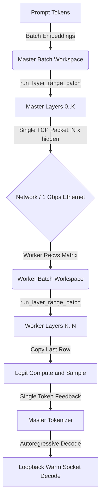

# High-Performance Single-Node and Distributed Clustered Inference Walkthrough

This document compiles the completed optimizations, benchmarking results, and
new default hardware runtime profiles landed in `NanoCamelid`, a
high-performance, zero-dependency Rust GGUF runner for both single-node and
distributed multi-node Raspberry Pi 5 clusters.

By combining single-core SIMD vectorization with a low-overhead,
pipeline-parallel raw socket cluster architecture, `NanoCamelid` can improve
inference throughput and run larger models across inexpensive edge devices.

## Repository and Artifacts

The authoritative active workspace root for NanoCamelid development is the
`NanoCamelid` repository. Private operator paths, local machine names, and
artifact directories are intentionally excluded from this public-facing
document. Keep reproducible benchmark summaries in the repo and retain raw
machine-local artifacts outside source control.

## Part 1: Single-Node Speedups and Key Benchmarks

All single-node benchmark trials were performed on a Raspberry Pi 5 with a
4-core Cortex-A76 CPU, `aarch64` Linux, and hardware `dotprod` capability.

### 1. Vectorized Q8 Dot Kernels

Microbenchmarks measuring raw quantized dot-product loops in nanoseconds per
32-element block:

| Kernel Variant | Latency (ns / block) | Speedup vs. Scalar | Speedup vs. Neon |
| :--- | :---: | :---: | :---: |
| Scalar | `4.76 ns` | Baseline (`1.00x`) | - |
| Neon | `2.11 ns` | `2.25x` | Baseline (`1.00x`) |
| SDOT (ARM DotProd) | `1.68 ns` | `2.83x` | `1.26x` |

Hardware `SDOT` scales arithmetic throughput on Cortex-A76 by packing multiple
multiply-accumulate operations into single-instruction cycles.

### 2. Q4 Layout Swizzling (1x4 Blocks)

Microbenchmarks measuring gate sweeps plus up sweeps for a standard Qwen-sized
model shape with `32,768` rows and `3,584` columns:

| Layout Strategy | Latency (ms) | Speedup |
| :--- | :---: | :---: |
| Row-major Q4 | `90.536 ms` | Baseline (`1.00x`) |
| Swizzled 1x4 Q4 | `70.648 ms` | `1.28x` |
| Page-aligned swizzled 1x4 | `68.337 ms` | `1.32x` |

Swizzled 1x4 blocks reduce cache-line misses and register loading overhead by
packing four blocks together. Page-aligned chunks offer a marginal speedup but
add virtual memory setup and page-table management overhead, so standard
swizzled 1x4 storage is the active default while page alignment remains an
opt-in experiment.

## Part 2: Distributed Clustered Inference and True Batched Prefill

NanoCamelid now includes a zero-dependency, pipeline-parallel clustered
execution runtime spanning multiple nodes over a physical 1 Gbps Ethernet
connection.

### 1. Network Transit Benchmarks

Using standard-library raw TCP streams configured with `TCP_NODELAY`, physical
transit latencies between nodes are low enough to represent less than 1% of the
compute time per token in the measured setup:

- p50 median transit latency: `0.355 ms`
- p95 transit latency: `0.359 ms`
- minimum transit latency: `0.332 ms`

### 2. Sparse Model Loading and Memory Footprint

To avoid out-of-memory failures on 8 GB Raspberry Pi 5 units when loading large
models, the loader dynamically maps and parses GGUF weights, selectively
loading only the layers assigned to each node.

This saves about `2.1 GB` of RAM per node during a 14B model split, enabling
smooth execution of models that would otherwise exceed a single node's memory
budget.

### 3. End-to-End Clustered Run: Strand 14B Q6_K

The cluster splits the 48-layer model into 24-layer ranges: `0..24` on the
master and `24..48` on the worker.

- Model: `Fortytwo_Strand-Rust-Coder-14B-v1-Q6_K.gguf`
- Test prompt: `Write a quick Rust hello-world function:`
- Token output, monolithic baseline: `[5168, 23811, 31792, 368, 1464, 923]`
- Text output, monolithic baseline: ` fn hello_world() -> String`
- Token output, clustered split: `[5168, 23811, 31792, 368, 1464, 923]`
- Text output, clustered split: ` fn hello_world() -> String`

The clustered split matched the monolithic baseline with exact token parity for
this run.

### 4. Batched Prefill Performance Gains

Initially, prompt ingestion streamed activations sequentially token by token.
With true batched prefill, the full prompt sequence is processed and transmitted
in one batched network payload:

| Prefill Strategy | Prompt Ingest Latency (seconds) | Prefill Phase Speedup |
| :--- | :---: | :---: |
| Token-by-token streaming | `7.602s` | Baseline (`1.00x`) |
| True batched prefill | `6.012s` | `1.26x` (`21%` reduction) |

Interactive decode throughput over physical 1 Gbps Ethernet was
`1.250 tokens/sec`.

## Implemented Architectural Optimizations

### 1. Reusable Batched Execution (`src/inference.rs`)

- `run_layer_range_batch`: implemented a range-based batch execution loop that
  bypasses unowned layers and performs SIMD batch normalization plus quantized
  matrix multiplications.
- Refactored prefill: updated `prefill_pass_batch` to invoke
  `run_layer_range_batch` under the hood while preserving exact behavior.

### 2. Batched Ingest and Streaming CLI (`src/bin/cluster_tcp_smoke.rs`)

- Master (`master-generate`): extracts embeddings for the full prompt, executes
  `run_layer_range_batch` for the bottom half, streams the full activation
  matrix in a single payload, and awaits single-token feedback.
- Worker (`worker`): dynamically inspects the packet header. If `seq_len > 1`,
  it runs the batch pipeline and copies only the last row's hidden state for
  sampling. If `seq_len == 1`, it routes through the single-token
  autoregressive path.

## Verification and Parity Results

The implementation was validated with:

1. `cargo fmt --all -- --check`
2. `cargo clippy --all-targets --all-features -- -D warnings`
3. `cargo test`
4. Clustered-vs-monolithic logit parity with `0.00000000` max logit delta

