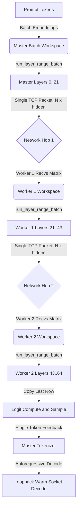

# High-Performance Single-Node and Distributed Clustered Inference Walkthrough

This document compiles the completed optimizations, benchmarking results, and
new default hardware runtime profiles landed in `NanoCamelid`, a
high-performance, zero-dependency Rust GGUF runner for both single-node and
distributed multi-node Raspberry Pi 5 clusters.

By combining single-core SIMD vectorization with a low-overhead,
pipeline-parallel raw socket cluster architecture, `NanoCamelid` can improve
inference throughput and run large models across inexpensive edge devices.

## Repository and Artifacts

This public-facing walkthrough intentionally excludes private operator paths,
local machine names, hostnames, and `file://` links. Keep reproducible benchmark
summaries in the repository and retain raw machine-local artifacts outside
source control.

## Part 1: Single-Node Speedups and Key Benchmarks

All single-node benchmark trials were performed on a Raspberry Pi 5 with a
4-core Cortex-A76 CPU, `aarch64` Linux, and hardware `dotprod` capability.

### 1. Vectorized Q8 Dot Kernels

Microbenchmarks measuring raw quantized dot-product loops in nanoseconds per
32-element block:

| Kernel Variant | Latency (ns / block) | Speedup vs. Scalar | Speedup vs. Neon |
| :--- | :---: | :---: | :---: |
| Scalar | `4.76 ns` | Baseline (`1.00x`) | - |
| Neon | `2.11 ns` | `2.25x` | Baseline (`1.00x`) |
| SDOT (ARM DotProd) | `1.68 ns` | `2.83x` | `1.26x` |

Hardware `SDOT` scales arithmetic throughput on Cortex-A76 by packing multiple
multiply-accumulate operations into single-instruction cycles.

### 2. Q4 Layout Swizzling (1x4 Blocks)

Microbenchmarks measuring gate sweeps plus up sweeps for a standard Qwen-sized
model shape with `32,768` rows and `3,584` columns:

| Layout Strategy | Latency (ms) | Speedup |
| :--- | :---: | :---: |
| Row-major Q4 | `90.536 ms` | Baseline (`1.00x`) |
| Swizzled 1x4 Q4 | `70.648 ms` | `1.28x` |
| Page-aligned swizzled 1x4 | `68.337 ms` | `1.32x` |

## Part 2: Distributed Clustered Inference and True Batched Prefill

NanoCamelid includes a zero-dependency, pipeline-parallel clustered execution
runtime spanning up to three nodes over a physical 1 Gbps Ethernet connection.

### 1. Network Transit Benchmarks

Using standard-library raw TCP streams configured with `TCP_NODELAY`, physical
transit latencies between nodes are low:

- p50 median transit latency: `0.355 ms`
- p95 transit latency: `0.359 ms`
- minimum transit latency: `0.332 ms`

### 2. Sparse Model Loading and Memory Footprint

To avoid out-of-memory failures on 8 GB Raspberry Pi 5 units when loading large
models, the loader selectively loads only the layers assigned to each node.

This saves about `2.1 GB` of RAM per node during a 14B split and up to about
`6.5 GB` of RAM per node during a 32B split, enabling edge devices to run large
models natively.

### 3. End-to-End Clustered Run: Strand 14B Q6_K

The cluster partitions the 48 layers into three ranges: `0..16`, `16..32`, and
`32..48`.

- Model: `Fortytwo_Strand-Rust-Coder-14B-v1-Q6_K.gguf`
- Test prompt: `Write a quick Rust hello-world function:`
- Tokens, monolithic baseline: `[5168, 23811, 31792, 368, 1464, 923]`
- Text, monolithic baseline: ` fn hello_world() -> String`
- Tokens, three-node clustered split: `[5168, 23811, 31792, 368, 1464, 923]`
- Text, three-node clustered split: ` fn hello_world() -> String`
- Interactive decode speed: `1.202 tokens/sec` over three nodes

The clustered split matched the monolithic baseline with exact token parity for
this run.

### 4. Running a 32B Coder Model: Qwen2.5-Coder-32B Instruct Q4_0

The three-node cluster can split a 64-layer 32B coder model into ranges
`0..21`, `21..43`, and `43..64`, avoiding the single-node out-of-memory failure
mode for this class of model.

- Model: `Qwen2.5-Coder-32B-Instruct-Q4_0.gguf`
- GGUF weight payload: about `19.4 GB`
- Tokens generated: `[3817, 368, 341, 257, 13751, 17223]`
- Text generated: `main() {\n     println!("`
- Prompt ingest with true batched prefill: `19.340s`
- Interactive decode speed: `0.556 tokens/sec`

## Implemented Architectural Optimizations

### 1. Reusable Batched Execution (`src/inference.rs`)

- `run_layer_range_batch`: implemented a range-based batch execution loop that
  bypasses unowned layers and performs SIMD batch normalization plus quantized
  matrix multiplications.
- Refactored prefill: overhauled `prefill_pass_batch` to invoke
  `run_layer_range_batch` under the hood.

### 2. Multi-Hop TCP Pipeline CLI (`src/bin/cluster_tcp_smoke.rs`)

- Master (`master-generate`): extracts prompt embeddings, runs
  `run_layer_range_batch` for the bottom layer range, streams the full
  activation matrix to the middle worker, and awaits single-token feedback from
  the final worker.
- Middle worker (`worker`): receives activations, processes its layer range, and
  transparently streams output activations forward to the next node in the
  pipeline.
- Final worker (`worker`): processes the final layer range, computes logits,
  samples the next token, and transmits the resulting token back to the master.

